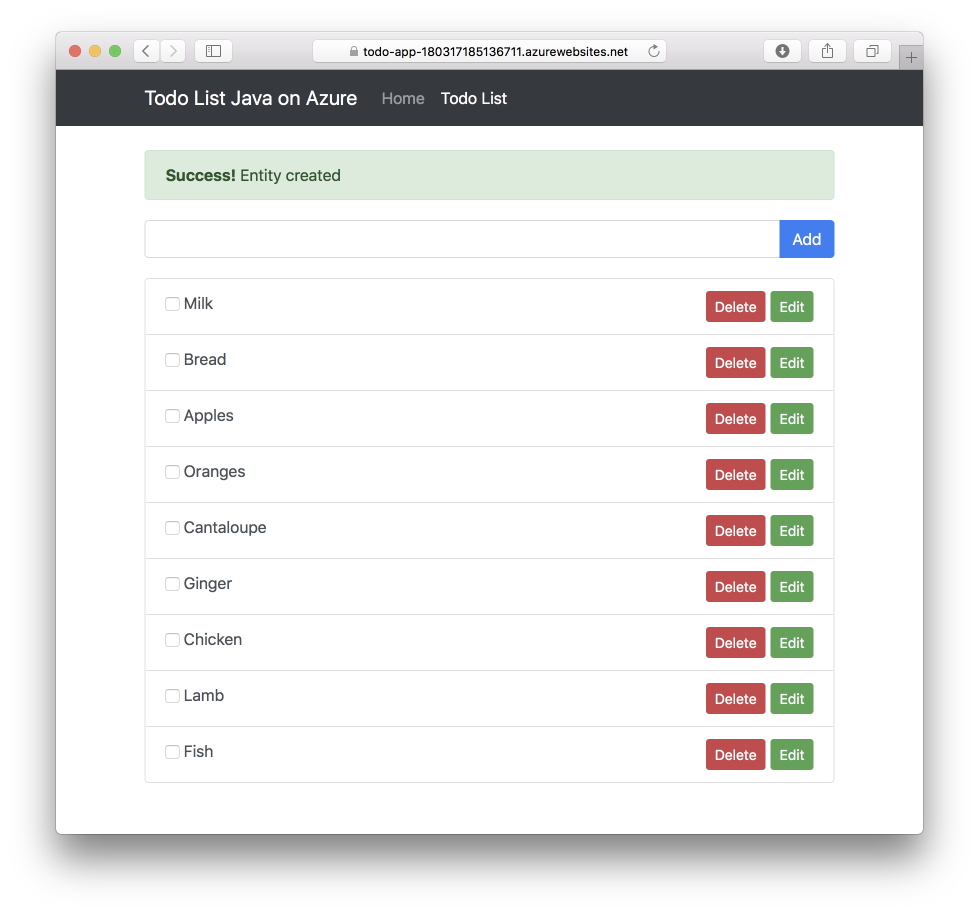

# Deploy Todo List App =TO=> Tomcat in Azure App Service Linux

This Todo List app is a Java application. It provides end-to-end 
CRUD operation to todo list item from front-end AngularJS code. 
Behind the scene, todo list item data store 
is [Azure CosmosDB DocumentDB](https://docs.microsoft.com/en-us/azure/cosmos-db/documentdb-introduction). 
This application uses [Azure CosmosDB DocumentDB Spring Boot Starter](https://github.com/Microsoft/azure-spring-boot/tree/master/azure-starters/azure-documentdb-spring-boot-starter) 
and AngularJS to interact with Azure. This sample application 
provides several deployment options to deploy to Azure, pls 
see deployment section below. With Azure support in Spring 
Starters, maven and gradle plugins and Eclipse / IntelliJ plugins, 
Java application development and deployment on Azure
are effortless now.


## TOC

* [Requirements](#requirements)
* [Create Azure Cosmos DB documentDB](#create-azure-cosmos-db-documentdb)
* [Configuration](#configuration)
* [Build](#build-todo-list-web-app---war)
* [Run Locally](#run-it-locally---optional-step)
* [Deploy to Tomcat on App Service on Linux](#deploy-to-tomcat-on-azure-app-service-on-linux)
* [Contribution](#contribution)
* [Useful link](#useful-link)

## Requirements

* [JDK](http://www.oracle.com/technetwork/java/javase/downloads/jdk8-downloads-2133151.html) 1.8 and above
* [Gradle](https://gradle.org/) 4.0 and above
* [Tomcat](https://tomcat.apache.org/download-80.cgi) 8.5 and above
## Create Azure Cosmos DB documentDB

You can follow our steps using [Azure CLI 2.0](https://docs.microsoft.com/en-us/cli/azure/install-azure-cli?view=azure-cli-latest) to deploy an Azure Cosmos DB documentDB,
or follow [this article](https://docs.microsoft.com/en-us/azure/cosmos-db/create-documentdb-java) to create it from Azure portal.

1. login your Azure CLI, and set your subscription id 
    
    ```bash
    az login
    az account set -s <your-subscription-id>
    ```
1. create an Azure Resource Group, and note your group name

    ```bash
    az group create -n <your-azure-group-name> -l <your-resource-group-region>
    ```

1. create Azure Cosmos DB with DocumentDB kind. Note the `documentEndpoint` field in the response.

   ```bash
   az cosmosdb create --kind GlobalDocumentDB -g <your-azure-group-name> -n <your-azure-documentDB-name>
   ```
   **Note** name of cosmos db must be in lowercase.
   
1. get your Azure Cosmos DB key, get the `primaryMasterKey` of the DocumentDB you just created.

    ```bash
    az cosmosdb list-keys -g <your-azure-group-name> -n <your-azure-documentDB-name>
    ```

## Configuration

Note down your DocumentDB uri and key from last step, 
specify a database name but no need to create it. Pick an 
Azure Resource Group name and Web app name for App Service 
on Linux - you can use an existing resource group and Web 
app or let the Gradle plugin create these for you. Set these values in system environment variables:

``` txt
DOCUMENTDB_URI=put-your-documentdb-uri-here
DOCUMENTDB_KEY=put-your-documentdb-key-here
DOCUMENTDB_DBNAME=put-your-documentdb-databasename-here

WEBAPP_RESOURCEGROUP_NAME=put-your-resourcegroup-name-here
WEBAPP_NAME=put-your-webapp-name-here
```

Optional. If you plan to test the Web app locally, then 
you must start a local instance of Tomcat. Set another value in
the system environment variable

``` txt
TOMCAT_HOME=put-your-tomcat-home-here
```

## Build Todo List Web App - WAR

```bash
gradle bootWar
```

## Run it locally - OPTIONAL STEP
Deploy the todo list app to local Tomcat.

```bash
gradle cargoRunLocal
```

## Deploy to Tomcat on Azure App Service on Linux

### Temporary Step - Until the Gradle Plugin for Azure Web Apps is released

Install a SNAPSHOT version of the Gradle Plugin for Azure Web Apps:

```bash
git clone https://github.com/lenala/azure-gradle-plugins.git
cd azure-webapp-gradle-plugin
./gradlew install
```
### Deploy to Tomcat on Azure App Service on Linux

Deploy in one step. You can continue to deploy again and 
again without restarting Tomcat.

```bash
gradle azureWebappDeploy
```

TODO: show how to deploy multiple applications.

### Temporary Step - until it is fixed on the App Service service-side

1. Go the Web App on Linux in the Azure Portal
2. Click on Development Tools / SSH
3. Click on Go --> to the app's SSH Shell

```bash
cd /home/site/wwwroot/webapps/ROOT
rm index.jsp
```

### Open the todo list Web app

Open it in a browser



## Clean up

Delete the Azure resources you created by running the following command:

```bash
az group delete -y --no-wait -n <your-resource-group-name>
```

## Contribution

This project welcomes contributions and suggestions.  Most contributions require you to agree to a
Contributor License Agreement (CLA) declaring that you have the right to, and actually do, grant us
the rights to use your contribution. For details, visit https://cla.microsoft.com.

When you submit a pull request, a CLA-bot will automatically determine whether you need to provide
a CLA and decorate the PR appropriately (e.g., label, comment). Simply follow the instructions
provided by the bot. You will only need to do this once across all repos using our CLA.

This project has adopted the [Microsoft Open Source Code of Conduct](https://opensource.microsoft.com/codeofconduct/).
For more information see the [Code of Conduct FAQ](https://opensource.microsoft.com/codeofconduct/faq/) or
contact [opencode@microsoft.com](mailto:opencode@microsoft.com) with any additional questions or comments.

## Useful link
- [Azure Spring Boot Starters](https://github.com/Microsoft/azure-spring-boot)
- [Azure Gradle plugins](https://github.com/lenala/azure-gradle-plugins.git)
